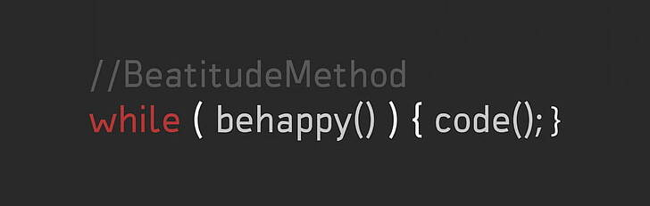

### Hi, I am Tanzila 👋 

### 

#### I am currently enrolled at [Microverse](https://www.microverse.org/?grsf=knrm9p) as a remote full-stack Web developer student.

### GitHub stats:

<!--
**tanzila-abedin/tanzila-abedin** is a ✨ _special_ ✨ repository because its `README.md` (this file) appears on your GitHub profile.

Here are some ideas to get you started:

- 🔭 I’m currently working on ...
- 🌱 I’m currently learning ...
- 👯 I’m looking to collaborate on ...
- 🤔 I’m looking for help with ...
- 💬 Ask me about ...
- 📫 How to reach me: ...
- 😄 Pronouns: ...
- ⚡ Fun fact: ...
-->
